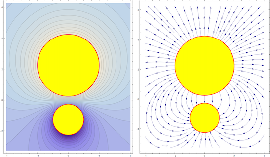

# The Electrostatic Potential Between Two Spherical Conductors

A non-trivial exercise in Mathematical Physics and its applications to Classical Electromagnetism, this essay solves in detail the problem of computing an analytical solution for the electrostatic potential between two conducting spheres. Originally written on January 4, 2010.

## License

I'm sharing this work under the [Creative Commons Attribution-ShareAlike 4.0 International (CC BY-SA 4.0)](http://creativecommons.org/licenses/by-sa/4.0/) license. See the LICENSE file for more information.
